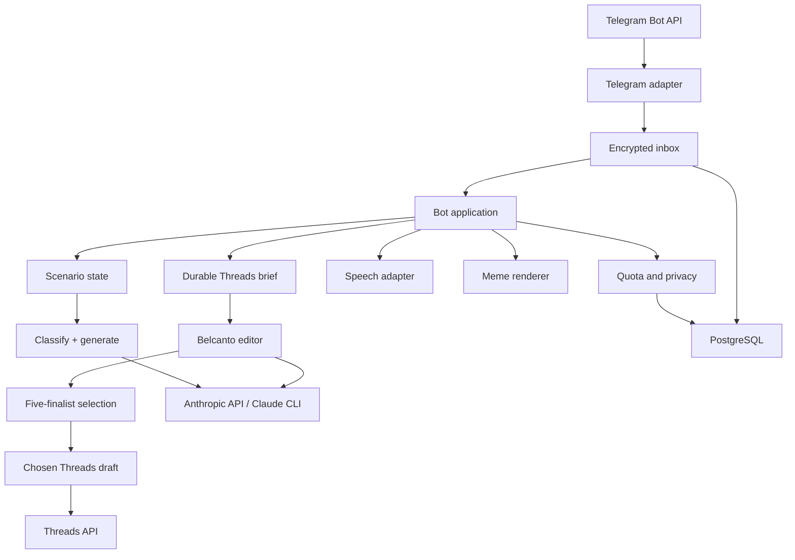

# Architecture

Witty Reply is a modular Go monolith. One process owns Telegram transport, application orchestration, AI providers, privacy controls, and HTTP health/metrics endpoints. PostgreSQL is the only production dependency besides external APIs.

## Boundaries

- `cmd/witty-reply` composes dependencies and handles process lifecycle.
- `internal/bot` owns commands, consent, auto/explicit scenario transitions, quota selection, generation, and callbacks.
- `internal/telegram` owns Bot API transport and Telegram-specific JSON types.
- `internal/ai` exposes one provider interface with Anthropic API, Claude CLI, and deterministic fake implementations. One structured call resolves `reply`/`comment`, reports high/low confidence, drafts three candidates, and—in comment mode—performs an internal multi-angle ranking pass.
- `internal/ai` also exposes a separate optional `ThreadPostGenerator`. It normalizes the selected objective and optional material, plans twelve scenario slots, calls a structured concept planner, calls a portfolio writer for five scenario-distinct finalists, and finally calls an objective-aware blind reviewer. Its schemas, grounding boundary, validation, and repair/fallback policy are independent from reply/comment generation.
- `internal/threads` owns the official Meta two-step text/image publication transport, disabled/fake modes, bounded responses, sanitized errors, and ambiguity classification. Access tokens never enter AI prompts, persistence, or logs.
- `internal/threadmedia` exposes only normalized owned JPEGs through short-lived signed HTTPS capability URLs so Meta never receives a Telegram file URL or bot token.
- `internal/store` owns durable metadata and opaque encrypted inbox payloads. Ordinary private reply/comment source text, screenshots, voice bytes, and transcripts never enter its domain records. The explicit Belcanto operator workflow is a narrower exception: its bounded text material, fixed objective, five validated selection options, and chosen draft are owner-scoped and retention-limited so goal/material collection and the exactly-one selection step are restart-safe and idempotent. Unselected options are not drafts and are never read as recent posts.
- `internal/session` keeps private source context in memory with a short TTL and last-write-wins cancellation.
- `internal/safety` provides an explicit deterministic moderation/filter stage before delivery. It normalizes common Unicode evasions and blocks high-confidence RU/KK/EN threats, doxxing, blackmail, self-harm encouragement, and hate/degradation.
- `internal/meme` renders an original branded card; it does not scrape internet memes.
- `internal/transcribe` converts voice bytes to text through a configured endpoint.
- `internal/observability` exports content-free counters and duration metrics.

## Data flow

1. Telegram update JSON is encrypted with AES-256-GCM and durably deduplicated by `update_id` before acknowledgement.
2. A leased worker claims jobs in strict per-user order. Processing is at least once: failed or abandoned leases are retried with bounded backoff, and terminal payloads are scrubbed.
3. The user record is upserted. AI processing stops unless consent exists.
4. Input is size/type validated. Media is downloaded only into memory.
5. The appropriate entitlement is reserved atomically.
6. A short-lived session records the source input, anonymized source hint, scenario state, revision, and previous candidates, and marks any older job for that user obsolete.
7. Style examples are loaded from PostgreSQL.
8. Explicit `ответь:`/`коммент:` prefixes or signed mode buttons force a scenario. Otherwise the AI provider returns a concrete scenario and confidence together with structured candidates. High confidence is delivered with a visible mode label and correction button. Low confidence commits an `awaiting_mode` session and displays two choices; generated candidates from that uncertain pass are not exposed.
9. The application performs independent schema, mode/tone consistency, length, diversity, and deterministic multilingual last-mile moderation checks. Scenario-aware fallbacks preserve the public-comment or private-reply voice. This layered guard is deliberately conservative and is not presented as perfect semantic moderation.
10. After payload scrubbing, the inbox retains only content-free delivery metadata until retention cleanup. Generation storage separately holds a secret-keyed, non-reversible source digest, resolved scenario inside result JSON, generated candidates, and provider/model identifiers. Token totals are exposed only as content-free aggregate metrics.
11. Telegram receives scenario-specific native copy/refinement buttons and signed mode/feedback callbacks. A refinement includes the original source and previous three candidates. If Telegram accepts the response but job completion is not recorded, a retry can produce a duplicate response; the system does not claim exactly-once outbound delivery.
12. Session source data expires automatically. Durable generated data is removed by the hourly retention cleanup job.

The Belcanto path is separate and durable:

1. An allowlisted, consented operator sends `/threads`. PostgreSQL idempotently creates or reloads an owned brief in `awaiting_goal`.
2. A signed callback stores one fixed objective: `reach`, `replies`, `trust`, `trial`, or `community`, then advances the brief to `awaiting_material`.
3. The next bounded text message becomes quoted evidence with kind `text`; for `reach`, `replies`, `trust`, and `community`, `✨ Без материала дня` records kind `none`. `trial` rejects that action before any AI call and remains `awaiting_material`, because conversion details cannot be invented. Duplicate Telegram updates resolve to the same brief through start/material update IDs. A valid material choice advances the brief to `material_ready` and survives a process restart.
4. The AI concept stage evaluates a deterministic twelve-slot scenario plan against the objective and evidence. A material-backed plan reserves at least four evidence-dependent slots. The writer stage produces five unique scenario IDs spanning at least four mechanisms and, when material exists, at least two evidence-backed finalists. Objective-specific scenario anchors prevent a formally diverse but strategically irrelevant portfolio. The blind-review stage applies objective-conditioned weights and grounding checks, ranks all five, and recommends one; with material, its recommendation must be evidence-backed. Material-backed review failure is fail-closed, so a weak local score may not silently replace evidence-aware review.
5. Local schema, evidence, fact, language, diversity, repetition, editorial, and last-mile safety gates run. The validated five-finalist selection is committed before Telegram displays it. At this boundary there is no new `ThreadDraft`, no media work, and no addition to recent-text repetition protection. Replaying the committed selection screen returns the same ranked options without another Anthropic request.
6. A signed, owner-scoped selection chooses exactly one finalist. The editor's first-ranked option is a recommendation: with material it is material-backed, while the operator may explicitly override it with another fact-safe evergreen option. The accepted choice atomically becomes the exact WYSIWYG current draft and is the only finalist added to recent-text protection. The other four remain outside similarity checks. Replaying the accepted selection returns the same draft without another Anthropic request or duplicate draft; callbacks for an obsolete selection revision are rejected.
7. Media handling starts only after selection. The editor may recommend a visual mode, but the application discards every model-written search query and derives a fixed object-or-space Pexels query from the chosen draft's validated scenario ID. It persists that application-derived fallback even when the recommendation is text-only, and derives it again for manual search, so operator material and generated prose never become Pexels input. Pexels bytes and attribution are validated and normalized before one owner/revision-scoped transaction swaps media; a failed search leaves the selected text authoritative. The operator can alternatively upload one verified Belcanto photo, which is resized and re-encoded without EXIF and never enters an AI prompt.
8. Format changes, attachments, and text refinements advance the durable draft revision and make previous signed keyboards stale. A signed publish callback atomically claims the exact revision with a fenced lease, stores the returned Threads container ID, waits for readiness, and marks the irreversible phase immediately before `threads_publish`. Image containers use a short-lived signed media URL; text containers require no public media origin. A crash before the marker is recoverable; an ambiguous result after it can only be reconciled from a later `PUBLISHED` status and otherwise becomes terminal `unknown`.

Brief material, finalist selections, drafts, and media are owner-scoped and removed by `/delete_me` or normal content-retention cleanup. Raw operator material is never written to logs or metrics.

## Delivery modes

Polling is the default local mode and permits one bot instance. Webhook is the production mode: the server checks `X-Telegram-Bot-Api-Secret-Token`, limits the body, enqueues work, and responds before AI processing.

## Failure model

- Duplicate update: ignored without quota charge.
- Database unavailable during enqueue: webhook returns `503`, prompting Telegram retry; polling does not advance its offset.
- Worker crash or restart: an expired lease makes the encrypted job claimable again; successful and dead-letter jobs retain no payload.
- Outbound acknowledgement ambiguity: a reply accepted by Telegram immediately before a worker crash may be sent again when the job is retried.
- New input during generation: previous job is cancelled/obsolete and may not send a late result.
- Provider timeout or malformed output: controlled user-facing retry message; raw provider output is never exposed.
- Threads concept/writer failure: a no-material workflow may use only a scenario-compatible validated fallback; material-backed generation never fabricates a replacement story from an unavailable stage.
- Threads reviewer failure with material: generation fails closed so a local stylistic score cannot certify factual grounding. The durable brief remains available for an explicit retry.
- Threads selection replay: the same committed five options are returned without regenerating them; replay of an accepted choice returns its one draft, while a different or stale choice cannot replace it.
- Threads provider disabled: draft generation remains available, while confirmation makes zero Meta calls and explains how to connect the deployment. Selecting `meta` with incomplete credentials fails startup.
- Definite Threads failure: the draft becomes retryable and keeps any known container ID. An expired pre-publish lease is recoverable; an expired or ambiguous post-attempt lease becomes `unknown`. Only a later `PUBLISHED` container status can reconcile it automatically; the service never repeats an unproven publish call.
- Low-confidence scenario: no uncertain candidate is exposed; the signed choice callback reuses the same source and original input quota.
- Wrong automatic scenario: the first signed correction is free, reuses the same source digest, and disables further free switches for that interaction.
- Database unavailable: readiness fails and generation does not start.
- Meme font/render failure: text candidates remain available.
- Restart/session expiry: durable queue, generations, user settings, the Belcanto goal/material brief, and an open five-finalist selection survive. Ordinary raw refinement/mode-switch sessions intentionally do not, so an ordinary user is asked to resend that source.

## Scaling path

The durable inbox and Belcanto brief support worker crash recovery. The ordinary reply/comment refinement session remains process-local, while any replica can claim a job from the shared inbox, so HTTP sticky routing alone cannot preserve those callbacks across replicas. Run exactly one application replica until shared encrypted sessions or consistent per-user worker ownership exists. The v2 deployment remains intentionally single-region; Kafka, Kubernetes, and microservices add no value at the current validation stage.
