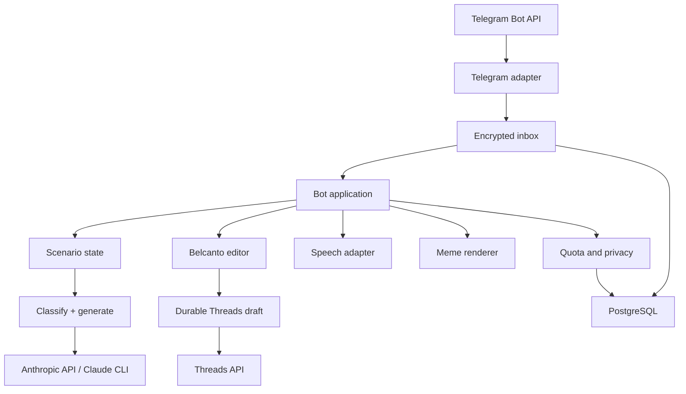

# Architecture

Witty Reply is a modular Go monolith. One process owns Telegram transport, application orchestration, AI providers, privacy controls, and HTTP health/metrics endpoints. PostgreSQL is the only production dependency besides external APIs.

## Boundaries

- `cmd/witty-reply` composes dependencies and handles process lifecycle.
- `internal/bot` owns commands, consent, auto/explicit scenario transitions, quota selection, generation, and callbacks.
- `internal/telegram` owns Bot API transport and Telegram-specific JSON types.
- `internal/ai` exposes one provider interface with Anthropic API, Claude CLI, and deterministic fake implementations. One structured call resolves `reply`/`comment`, reports high/low confidence, drafts three candidates, and—in comment mode—performs an internal multi-angle ranking pass.
- `internal/ai` also exposes a separate optional `ThreadPostGenerator`. Its system prompt, JSON schema, immutable fact boundary, validation, and repair retry are independent from reply/comment generation.
- `internal/threads` owns the official Meta two-step text/image publication transport, disabled/fake modes, bounded responses, sanitized errors, and ambiguity classification. Access tokens never enter AI prompts, persistence, or logs.
- `internal/threadmedia` exposes only normalized owned JPEGs through short-lived signed HTTPS capability URLs so Meta never receives a Telegram file URL or bot token.
- `internal/store` owns durable metadata and opaque encrypted inbox payloads. It never receives plaintext source text, screenshots, voice bytes, or transcripts.
- `internal/session` keeps private source context in memory with a short TTL and last-write-wins cancellation.
- `internal/safety` provides an explicit deterministic moderation/filter stage before delivery. It normalizes common Unicode evasions and blocks high-confidence RU/KK/EN threats, doxxing, blackmail, self-harm encouragement, and hate/degradation.
- `internal/meme` renders an original branded card; it does not scrape internet memes.
- `internal/transcribe` converts voice bytes to text through a configured endpoint.
- `internal/observability` exports content-free counters and duration metrics.

## Data flow

1. Telegram update JSON is encrypted with AES-256-GCM and durably deduplicated by `update_id` before acknowledgement.
2. A leased worker claims jobs in strict per-user order. Processing is at least once: failed or abandoned leases are retried with bounded backoff, and terminal payloads are scrubbed.
3. The user record is upserted. AI processing stops unless consent exists.
4. Input is size/type validated. Media is downloaded only into memory.
5. The appropriate entitlement is reserved atomically.
6. A short-lived session records the source input, anonymized source hint, scenario state, revision, and previous candidates, and marks any older job for that user obsolete.
7. Style examples are loaded from PostgreSQL.
8. Explicit `ответь:`/`коммент:` prefixes or signed mode buttons force a scenario. Otherwise the AI provider returns a concrete scenario and confidence together with structured candidates. High confidence is delivered with a visible mode label and correction button. Low confidence commits an `awaiting_mode` session and displays two choices; generated candidates from that uncertain pass are not exposed.
9. The application performs independent schema, mode/tone consistency, length, diversity, and deterministic multilingual last-mile moderation checks. Scenario-aware fallbacks preserve the public-comment or private-reply voice. This layered guard is deliberately conservative and is not presented as perfect semantic moderation.
10. After payload scrubbing, the inbox retains only content-free delivery metadata until retention cleanup. Generation storage separately holds a secret-keyed, non-reversible source digest, resolved scenario inside result JSON, generated candidates, and provider/model identifiers. Token totals are exposed only as content-free aggregate metrics.
11. Telegram receives scenario-specific native copy/refinement buttons and signed mode/feedback callbacks. A refinement includes the original source and previous three candidates. If Telegram accepts the response but job completion is not recorded, a retry can produce a duplicate response; the system does not claim exactly-once outbound delivery.
12. Session source data expires automatically. Durable generated data is removed by the hourly retention cleanup job.

The Belcanto path is separate: an allowlisted operator sends `/threads`; the post generator chooses an evergreen premise; last-mile fact and safety checks run; and PostgreSQL stores exactly the WYSIWYG preview as the only current draft for that operator. The default draft is text-only. The operator can request one real photo; that Telegram update is processed in strict order, resized/re-encoded without EXIF, stored owner-scoped, and returned as the exact photo-plus-caption preview. Format changes and attachments advance the durable revision. A signed publish callback atomically claims that revision with a short fenced lease before the first Meta call, stores the returned text/image container ID, waits for a ready status, and durably marks the irreversible phase immediately before `threads_publish`. Image containers use a one-hour signed media URL; text containers require no public media origin. A crash before the marker is safely recoverable with the known container; a crash or ambiguous result after it can only be reconciled from a later `PUBLISHED` status and is otherwise terminal `unknown`. Older revisions, stale workers, duplicate taps, queue redelivery, and restarts cannot publish the draft twice.

## Delivery modes

Polling is the default local mode and permits one bot instance. Webhook is the production mode: the server checks `X-Telegram-Bot-Api-Secret-Token`, limits the body, enqueues work, and responds before AI processing.

## Failure model

- Duplicate update: ignored without quota charge.
- Database unavailable during enqueue: webhook returns `503`, prompting Telegram retry; polling does not advance its offset.
- Worker crash or restart: an expired lease makes the encrypted job claimable again; successful and dead-letter jobs retain no payload.
- Outbound acknowledgement ambiguity: a reply accepted by Telegram immediately before a worker crash may be sent again when the job is retried.
- New input during generation: previous job is cancelled/obsolete and may not send a late result.
- Provider timeout or malformed output: controlled user-facing retry message; raw provider output is never exposed.
- Threads provider disabled: draft generation remains available, while confirmation makes zero Meta calls and explains how to connect the deployment. Selecting `meta` with incomplete credentials fails startup.
- Definite Threads failure: the draft becomes retryable and keeps any known container ID. An expired pre-publish lease is recoverable; an expired or ambiguous post-attempt lease becomes `unknown`. Only a later `PUBLISHED` container status can reconcile it automatically; the service never repeats an unproven publish call.
- Low-confidence scenario: no uncertain candidate is exposed; the signed choice callback reuses the same source and original input quota.
- Wrong automatic scenario: the first signed correction is free, reuses the same source digest, and disables further free switches for that interaction.
- Database unavailable: readiness fails and generation does not start.
- Meme font/render failure: text candidates remain available.
- Restart/session expiry: durable queue, generations, and user settings survive; raw refinement/mode-switch sessions intentionally do not, so the user is asked to resend the source.

## Scaling path

The durable inbox supports multiple workers and crash recovery inside one application process. The refinement session is process-local, while any replica can claim a job from the shared inbox, so HTTP sticky routing alone cannot preserve callbacks across replicas. Run exactly one application replica until shared encrypted sessions or consistent per-user worker ownership exists. The v2 deployment remains intentionally single-region; Kafka, Kubernetes, and microservices add no value at the current validation stage.
